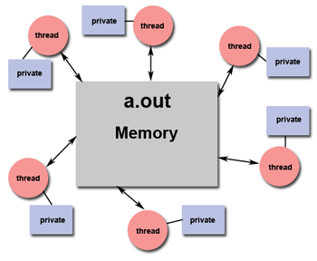
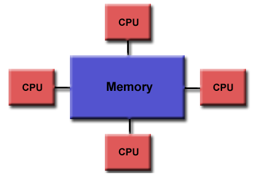

# Computación Paralela y Distribuida

## Procesamiento serial

Tradicionalmente, el software se ha escrito para computación serial, donde:

- un problema se divide en una serie discreta de instrucciones (pasos bien separados y diferenciados),
- las instrucciones se ejecutan secuencialmente una tras otra (una instrucción solo puede iniciar su ejecución cuando la anterior ha terminado),
- todo se ejecuta en un solo procesador,
- una sola instrucción puede ser ejecutada en un momento dado cualquiera.

## Procesamiento concurrente o paralelo

Si bien ambos términos tienen ciertas diferencias, en general implican dividir una tarea compleja y procesarla en múltiples sistemas o procesadores, para producir la salida o resultado final más rápidamente (si se compara con procesar la tarea en un solo sistema o procesador). 
El procesamiento paralelo es esencial cuando la tarea implica procesar una gran cantidad de datos complejos, ej: acceso a grandes bases de datos, cálculos astronómicos o ambientales, física atómica y nuclear, procesamiento de imágenes, etc.

El paralelismo se puede implementar utilizando computadoras paralelas, es decir, una computadora con muchos procesadores, o sistemas paralelos, es decir varias computadoras interconectadas.
Las computadoras paralelas requieren algoritmos paralelos, lenguajes de programación, compiladores y sistemas operativos que admitan la multitarea.

### Computadoras paralelas?

### Por qué? Para qué?

## Algoritmos

Un algoritmo es una secuencia de instrucciones que se sigue para resolver un problema.
Al diseñar un algoritmo, debemos idealmente considerar la arquitectura de la computadora en la que se ejecutará el algoritmo, para que este sea lo más eficiente posible
Según la arquitectura, hay dos tipos de computadoras:  

- Computadora secuencial
- Computadora paralela

Dependiendo de la arquitectura de las computadoras, entonces, tenemos dos tipos de algoritmos:

- Algoritmo secuencial,
    - en el que se ejecutan algunos pasos consecutivos de instrucciones en orden cronológico para resolver un problema. 
- Algoritmo paralelo,
    - donde el problema se divide en subproblemas y se ejecutan en paralelo para obtener salidas o resultados individuales. Más adelante, estas salidas individuales se combinan para obtener la salida final deseada. 

Pero…

- no es fácil dividir un gran problema en subproblemas,
- los subproblemas pueden tener dependencia de datos entre ellos,
- por lo tanto, los procesadores tienen que comunicarse entre sí para resolver el problema, y
- se ha descubierto que el tiempo que necesitan los procesadores para comunicarse entre sí es mayor que el tiempo de procesamiento real.

## Modelos de Computación

Al diseñar un algoritmo paralelo, se debe considerar la utilización adecuada de la CPU para obtener un algoritmo eficiente, y para diseñar estos algoritmos correctamente, se debe tener una idea clara del modelo básico de computación en una computadora paralela.

### Taxonomía de Flynn

- Single Instruction stream, Single Data stream (SISD)
    - Flujo de instrucción única, flujo de datos único
- Single Instruction stream, Multiple Data stream (SIMD)
    - Flujo de instrucción única, flujos de datos múltiples
- Multiple Instruction stream, Single Data stream (MISD)
    - Flujo de instrucción múltiple, flujo de datos único
- Multiple Instruction stream, Multiple Data stream (MIMD)
    - Flujos de instrucciones múltiples, flujos de datos múltiples
(NOTA: instrucción se entiende también como programa I -> P)

#### Computadoras SISD: Single Instruction Single Data

Las computadoras SISD contienen una unidad de control, una unidad de procesamiento y una unidad de memoria.   

El procesador recibe un flujo único de instrucciones de la unidad de control y opera en un flujo único de datos desde la unidad de memoria.

Durante el cálculo, en cada paso, el procesador ejecuta una sola instrucción recibida de la unidad de control y opera o manipula un solo dato recibido de la unidad de memoria.

Ej: una computadora serial (viejas computadoras de un solo núcleo)

#### Computadoras SIMD: Single Instruction Multiple Data

Las computadoras SIMD contienen una unidad de control, múltiples unidades de procesamiento y memoria compartida local o en red.

Aquí, una sola unidad de control envía un mismo flujo de instrucciones a todas las unidades de procesamiento.

Durante el cálculo, en cada paso, todos los procesadores reciben una misma instrucción de la unidad de control, pero operan en un conjunto diferente de datos, recibidos de la unidad de memoria.

Ej: GPUs

#### Computadoras MISD: Multiple Instruction Single Data

Las computadoras MISD contienen múltiples unidades de control, múltiples unidades de procesamiento pero una sola unidad de memoria común.   

Aquí, cada procesador tiene su propia unidad de control, pero entre todos comparten la misma unidad de memoria.

Todos los procesadores obtienen instrucciones individualmente de su propia unidad de control, las instrucciones pueden ser diferentes para cada uno, pero operan sobre un solo flujo de datos, es decir el mismo dato lo procesan todos.

Ej: es difícil encontrar esta arquitectura, es un poco más teórica para completar el modelo, sin embargo, un ejemplo sería en sistemas redundantes para controles de tolerancia a fallo:

- diferentes procesadores, posiblemente incluso con diferentes arquitecturas, efectúan el mismo cálculo (sobre el mismo dato), tal vez con diferentes técnicas, y se ve si los resultados concuerdan !!!

#### Computadoras MIMD: Multiple Instruction Multiple Data

Las computadoras MIMD tienen múltiples unidades de control, múltiples unidades de procesamiento y una memoria compartida o una red de interconexión.     

Aquí, cada procesador tiene su propia unidad de control, así como su propia unidad de memoria local y su unidad aritmética y lógica. 

Los procesadores reciben diferentes conjuntos de instrucciones de sus respectivas unidades de control y operan en diferentes conjuntos de datos.

Una computadora MIMD que comparte una memoria común se conoce como computadora multiprocesador, mientras que las que usan una red de interconexión se suelen conocer como clúster o sistema distribuido.   

- clúster: cuando todos los procesadores están muy cerca uno del otro (por ejemplo, en el mismo rack o la misma habitación). 
- sistema distribuido: cuando todos los procesadores están lejos uno del otro (por ejemplo, en diferentes ciudades) 

Ej: esta es la típica computadora actual de varios procesadores o varios núcleos!

## Modelos de Algoritmos Paralelos

El modelo de un algoritmo paralelo debe escogerse considerando una estrategia apropiada para:

- el método o funciones de procesamiento que se aplicarán,
- la división de datos que será necesaria,
- y para reducir al máximo las interacciones entre procesos

De entre los múltiples modelos que podrían utilizarse, revisaremos los más utilizados o relevantes:

- Modelo de hilos (Threads)
- Modelo de datos en paralelo
- Modelo de grupo de trabajo (Workpool)
- Modelo productor-consumidor (Pipeline)

Muchas veces es necesario combinar estos modelos al diseñar nuestra solución !

### Modelos de hilos

Este es un modelo de programación de memoria compartida: en un solo programa, ejecutándose en un equipo o computador con capacidad de multiproceso.

En este modelo un solo proceso (programa en ejecución) principal o "pesado" puede tener múltiples subprocesos o rutas de ejecución concurrentes "ligeras" (hilos).

Por ejemplo: el programa principal a.out se ejecuta. a.out carga y adquiere todos los recursos necesarios del sistema y del usuario para ejecutarse. Este es el proceso "pesado".
a.out realiza algunos trabajos en serie y luego crea una serie de tareas (subprocesos) que el sistema operativo puede programar y ejecutar simultáneamente.

Estos subprocesos son los “ligeros” y se llaman hilos (threads). 

Cada hilo tiene datos locales, pero también comparte todos los recursos de a.out. Esto ahorra los gastos generales asociados con la replicación de los recursos de un programa para cada subproceso ("ligero"). Cada subproceso también se beneficia de acceder a la memoria global porque comparte el espacio global de memoria de a.out.

El trabajo de un hilo puede describirse mejor como una subrutina dentro del programa principal. Cualquier subproceso puede ejecutar cualquier subrutina al mismo tiempo que otros subprocesos.
Los hilos se comunican entre sí a través de la memoria global (actualizando variables). Esto requiere el uso de elementos de sincronización para garantizar que no haya más de un hilo actualizando la misma variable global al mismo tiempo.

Los subprocesos pueden ir y venir, iniciar y terminar, pero a.out debe permanecer presente o activo para proporcionar los recursos compartidos necesarios hasta que la aplicación se haya completado.

### Modelos de datos en paralelo

En el modelo paralelo de datos, las tareas se asignan a procesos y cada tarea realiza tipos similares de operaciones en diferentes datos.

Recuérdese SIMD: una operación única se aplica a diferentes datos en cada procesador.

El modelo paralelo de datos se puede trabajar con paradigmas de memoria compartida (un solo computador multiproceso) y paradigmas de paso de mensajes (múltiples computadores interconectados).

La característica principal de los casos que utilizan el modelo de datos paralelos es que la intensidad del paralelismo de datos aumenta con el tamaño del problema, lo que a su vez hace posible utilizar más procesos para resolver problemas más grandes. Es decir, a más datos, más se pueden dividir y pasar a diferentes procesadores.

Ej: multiplicación de arreglos o matrices

### Modelo de Grupo de Trabajo

En el modelo de grupo de trabajo, todas las tareas a realizarse se ponen en un contenedor central o común, y luego se asignan dinámicamente a los procesos para equilibrar la carga, por lo tanto, cualquier proceso puede potencialmente ejecutar cualquier tarea. 

Ejemplo: Ejecutores en Java (ya los veremos, recuerde el nombre ¡)

### Modelo productor-consumidor (Pipeline)

Aquí se pasa un conjunto de datos a través de una serie de procesos, cada uno de los cuales realiza alguna tarea en los datos. 

Al llegar un nuevo dato, algún proceso puede generar una nueva tarea (productor) que puede ser depositada en una cola (queue). Algún otro proceso recogerá esta tarea de la cola para procesarla (consumidor). La tarea procesada puede dar lugar a una nueva tarea, y así sucesivamente.

Este modelo es una cadena de productores y consumidores. 

Cada proceso en la cola puede considerarse como un productor de datos para el proceso que lo sigue en la cola y como un consumidor de datos del proceso que lo precede en la cola.

Ejemplo : Filtros de imágenes

## Compartición de datos

Para que entre los diferentes procesos se puedan compartir los datos que han de procesarse, hay que escoger una estrategia o modelo. Los dos más utilizados son:

- Modelo de memoria compartida
    - y de memoria distribuida compartida
- Modelo de memoria distribuida
    - utiliza paso de mensajes

### Modelo de memoria compartida

En el modelo de memoria compartida, múltiples procesos se ejecutan en diferentes procesadores de forma independiente, pero comparten un espacio de memoria común. 

Si hay cambios en cualquier ubicación de memoria, esto es visible para todos los procesadores.   

Es probable que en un momento dado (al mismo tiempo), más de un procesador acceda a la misma ubicación de memoria. 

Supongamos que uno está leyendo esa ubicación y el otro está escribiendo en esa ubicación. Esto puede crear confusión, ya que es probable que el proceso lector, lea datos “a medio escribir”.

Si en cambio dos procesos están escribiendo al mismo tiempo, esto puede crear daño en los datos. ¿Cuál es el dato que quedó en la memoria finalmente? ¿O se “mezclaron”?

Para evitar estos problemas de acceso concurrente, es necesario implementar algún mecanismo de control, o sincronización, como un bloqueo / semáforo, para garantizar la exclusión mutua. 

### Arquitecturas de memoria compartida

#### UMA: Unified Memory Access

Típicas computadoras de un procesador con múltiples núcleos. Todos los núcleos comparten toda la memoria.

#### NUMA: Non Unified Memory Access

Generalmente las computadoras de varios procesadores (varios sockets) tienen la ram atada a cada procesador, un bloque de ram es exclusivo de un procesador (los núcleos de un mismo procesador comparten la memoria en UMA).

Si bien la memoria de un procesador es exclusiva, se puede pasar información entre procesadores, pero puede ser un proceso más bien lento (y en ciertos casos no es posible hacerlo).

Muchos sistemas de GPU, por ejemplo, trabajan bajo una arquitectura NUMA.

#### Memoria compartida y Sincronización

Para evitar los problemas de acceso concurrente, por parte de los procesadores, a la memoria, es necesario imponer algún tipo de restricción o sincronización. Los distintos tipos genéricos (teóricos) son:

- Lectura exclusiva Escritura exclusiva (LEEE): aquí no se permite que dos procesadores lean o escriban en la misma ubicación de memoria al mismo tiempo. Este es el modelo más restrictivo, pero más seguro.
- Lectura exclusiva Escritura simultánea (LEES): aquí no se permite que dos procesadores lean desde la misma ubicación de memoria al mismo tiempo, pero sí pueden escribir en la misma ubicación de memoria al mismo tiempo. Este modelo no es práctico, ya que es la escritura simultánea la que puede dañar los datos.
- Lectura simultánea Escritura exclusiva (LSEE): aquí todos los procesadores pueden leer desde la misma ubicación de memoria al mismo tiempo, pero solo uno puede escribir en una ubicación de memoria al mismo tiempo. Este es el modelo más eficiente, cuando puede utilizarse!
- Lectura simultánea Escritura simultánea (LSES): todos los procesadores pueden leer o escribir en la misma ubicación de memoria al mismo tiempo. Nuevamente, este modelo es impráctico por la escritura simultánea.

### Memoria distribuida

En este modelo, todos los procesadores tienen su propia unidad de memoria local e intercambian datos mediante mensajes que se envían  a través de una red de comunicación.

#### Modelo de paso de mensajes

El paso de mensajes es el enfoque de programación paralela más utilizado en los sistemas de memoria distribuida.

Los mensajes pueden enviarse en varias modalidades, dependiendo de su alcance:

- Comunicación punto a punto
    - La comunicación punto a punto es la forma más simple de pasar mensajes.
    - Aquí, se puede enviar un mensaje desde el procesador emisor a un procesador receptor mediante cualquiera de los siguientes modos de transferencia:
    - Modo sincrónico
        - el siguiente mensaje se envía solo después de recibir una confirmación de que se ha entregado su mensaje anterior, para mantener la secuencia del mensaje. 
    - Modo asincrónico
        - para enviar el siguiente mensaje, no es necesario recibir la confirmación de la entrega del mensaje anterior. 
- Comunicación colectiva
    - La comunicación colectiva implica más de dos procesadores para pasar mensajes. Los mensajes se envían en modo de “Broadcast”:
        - Un procesador con una sola operación envía el mismo mensaje a todos los demás procesadores
##### Interfaz de paso de mensajes, MPI

MPI, Message Passing Interface, es un estándar universal para proporcionar comunicación entre todos los procesos concurrentes en un sistema de memoria distribuida. 

La mayoría de las plataformas de computación paralela comúnmente utilizadas proporcionan al menos una implementación de la interfaz de paso de mensajes, por ejemplo, OpenMPI o MPICH.